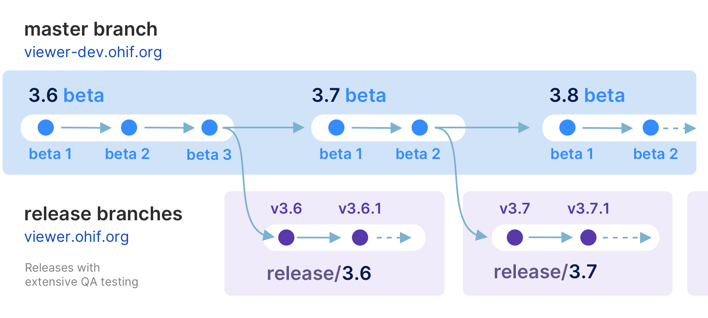

<!-- prettier-ignore-start -->
<div align="center">
  <h1>OHIF 医学影像查看器</h1>
  <p><strong>OHIF 查看器</strong>是由<a href="https://ohif.org/">开放健康影像基金会 (OHIF)</a>提供的零占用医学影像查看器。它是一个可配置和可扩展的渐进式 Web 应用程序，开箱即支持符合 <a href="https://www.dicomstandard.org/using/dicomweb/">DICOMweb</a> 标准的影像归档系统。</p>
</div>


<div align="center">
  <a href="https://docs.ohif.org/"><strong>阅读文档</strong></a>
</div>
<div align="center">
  <a href="https://viewer.ohif.org/">在线演示</a> |
  <a href="https://ui.ohif.org/">组件库</a>
</div>
<div align="center">
  📰 <a href="https://ohif.org/news/"><strong>订阅 OHIF 新闻通讯</strong></a> 📰
</div>
<div align="center">
  📰 <a href="https://ohif.org/news/"><strong>订阅 OHIF 新闻通讯</strong></a> 📰
</div>


<hr />

[![NPM version][npm-version-image]][npm-url]
[![MIT License][license-image]][license-url]
[![This project is using Percy.io for visual regression testing.][percy-image]](percy-url)
<!-- [![NPM downloads][npm-downloads-image]][npm-url] -->
<!-- [![Pulls][docker-pulls-img]][docker-image-url] -->
<!-- [](https://app.fossa.io/projects/git%2Bgithub.com%2FOHIF%2FViewers?ref=badge_shield) -->

<!-- [![Netlify Status][netlify-image]][netlify-url] -->
<!-- [![CircleCI][circleci-image]][circleci-url] -->
<!-- [![codecov][codecov-image]][codecov-url] -->
<!-- [](#contributors) -->
<!-- prettier-ignore-end -->


|     |  | |
| :-: | :---  | :--- |
|  | 测量跟踪 | [演示](https://viewer.ohif.org/viewer?StudyInstanceUIDs=1.3.6.1.4.1.25403.345050719074.3824.20170125095438.5) |
|  | 标签图分割  | [演示](https://viewer.ohif.org/viewer?StudyInstanceUIDs=1.3.12.2.1107.5.2.32.35162.30000015050317233592200000046) |
|  | 融合和自定义悬挂协议  | [演示](https://viewer.ohif.org/tmtv?StudyInstanceUIDs=1.3.6.1.4.1.14519.5.2.1.7009.2403.334240657131972136850343327463) |
|  | 体积渲染  | [演示](https://viewer.ohif.org/viewer?StudyInstanceUIDs=1.3.6.1.4.1.25403.345050719074.3824.20170125095438.5&hangingprotocolId=mprAnd3DVolumeViewport) |
|  | PDF  | [演示](https://viewer.ohif.org/viewer?StudyInstanceUIDs=2.25.317377619501274872606137091638706705333) |
|  | RT STRUCT  | [演示](https://viewer.ohif.org/viewer?StudyInstanceUIDs=1.3.6.1.4.1.5962.99.1.2968617883.1314880426.1493322302363.3.0) |
|  | 4D  | [演示](https://viewer.ohif.org/dynamic-volume?StudyInstanceUIDs=2.25.232704420736447710317909004159492840763) |
|  | 视频  | [演示](https://viewer.ohif.org/viewer?StudyInstanceUIDs=2.25.96975534054447904995905761963464388233) |
|  | 切片显微镜  | [演示](https://viewer.ohif.org/microscopy?StudyInstanceUIDs=2.25.141277760791347900862109212450152067508) |

## 关于

OHIF 查看器可以从大多数来源和格式检索和加载影像，以 2D、3D 和重建表示形式渲染图像集；允许对观察结果进行操作、标注和序列化；支持国际化、OpenID Connect、离线使用、快捷键等众多功能。

几乎所有功能都提供一定程度的自定义和配置。如果它不支持您需要的功能，我们接受拉取请求，并拥有不断改进的扩展系统。

## 为什么选择我们

### 社区与经验

OHIF 查看器是一项协作成果，已成为许多活跃的、生产环境的和 FDA 认证的医学影像查看器的基础。它受益于我们广泛社区的集体经验，以及来自个人、研究团体和商业组织的赞助贡献。

### 为适应而生

经过 8 年多与众多公司和组织的集成，OHIF 查看器已从头重建，以更好地满足其众多用户的不同工作流程和配置需求。查看器的所有核心功能都是使用其自身的扩展系统构建的。同样的可扩展性使我们能够提供：

- 2D 和 3D 医学影像查看
- 多平面重建 (MPR)
- 最大密度投影 (MIP)
- 全切片显微镜查看
- PDF 和 DICOM 结构化报告渲染
- 以标签图和轮廓形式渲染分割
- 用户访问控制 (UAC)
- 上下文特定的工具栏和侧面板内容
- 以及更多其他功能

您可以利用这些功能为您的工作流程自定义查看器，并添加您可能需要的任何新功能（并希望私下维护而无需分叉）。

### 支持

- [报告错误 🐛](https://github.com/OHIF/Viewers/issues/new?assignees=&labels=Community%3A+Report+%3Abug%3A%2CAwaiting+Reproduction&projects=&template=bug-report.yml&title=%5BBug%5D+)
- [请求功能 🚀](https://github.com/OHIF/Viewers/issues/new?assignees=&labels=Community%3A+Request+%3Ahand%3A&projects=&template=feature-request.yml&title=%5BFeature+Request%5D+)
- [提问 🤗](community.ohif.org)
- [Slack 频道](https://join.slack.com/t/cornerstonejs/shared_invite/zt-1r8xb2zau-dOxlD6jit3TN0Uwf928w9Q)

如需商业支持、学术合作和常见问题解答，请使用[获取支持](https://ohif.org/get-support/)与我们联系。


## 开发

### 分支

#### `master` 分支 - 最新开发（测试）版本

- `master` - 最新开发版本

这通常是最新开发工作的地方。master 分支中的代码已通过代码审查和自动化测试，但可能尚未被认为可用于生产环境。该分支通常包含开发团队正在开发的最新更改和功能。它通常是创建功能分支（开发新功能的地方）和热修复分支（用于紧急修复）的起点。

每个包都标记有测试版本号，并发布到 npm，例如 `@ohif/ui@3.6.0-beta.1`

### `release/*` 分支 - 最新稳定版本
一旦 `master` 分支代码达到稳定、可发布的状态，我们会进行全面的代码审查和 QA 测试。获得批准后，我们从 `master` 创建一个新的发布分支。这些分支代表被认为可用于生产环境的最新稳定版本。

例如，`release/3.5` 是 3.5.0 版本的分支，`release/3.6` 是 3.6.0 版本的分支。每次发布后，我们会等待几天以确保没有关键错误。如果发现任何错误，我们会在发布分支中修复它们，并创建一个带有次要版本号增量的新版本，例如 `release/3.5` 分支中的 3.5.1。

每个包都标记有版本号并发布到 npm，例如 `@ohif/ui@3.5.0`。请注意，`master` 始终领先于 `release` 分支。我们为测试版和稳定版本都发布 Docker 构建。

以下是我们开发工作流程的示意图：




### 要求

- [Yarn 1.20.0+](https://yarnpkg.com/en/docs/install)
- [Node 18+](https://nodejs.org/en/)
- 您的机器上应启用 Yarn Workspaces：
  - `yarn config set workspaces-experimental true`

### 入门指南

1. [Fork 此仓库][how-to-fork]
2. [克隆您 fork 的仓库][how-to-clone]
   - `git clone https://github.com/YOUR-USERNAME/Viewers.git`
3. 导航到克隆项目的目录
4. 将此仓库添加为名为 `upstream` 的 `remote`
   - `git remote add upstream https://github.com/OHIF/Viewers.git`
5. 运行 `yarn install --frozen-lockfile` 以恢复依赖项并链接项目

:::danger
通常使用 `--frozen-lockfile` 标志运行 `yarn install`，通过强制执行可重现的依赖项来帮助避免供应链攻击。也就是说，如果 `yarn.lock` 文件是干净的并且不引用受损的包，那么使用此标志就不应该有受损的包落到您的机器上。
:::

#### 开发

_从此仓库的根目录：_

```bash
# 启用 Yarn Workspaces
yarn config set workspaces-experimental true

# 恢复依赖项
yarn install --frozen-lockfile
```

## 命令

这些命令可从根目录使用。每个项目目录还支持许多命令，可以在各自的 `README.md` 和 `package.json` 文件中找到。

| Yarn 命令                | 描述                                                   |
| ---------------------------- | ------------------------------------------------------------- |
| **开发**                  |                                                               |
| `dev`              | 查看器的默认开发体验                     |
| `dev:fast`             | 我们的实验性快速开发模式，使用 rsbuild 而不是 webpack                     |
| `test:unit`                  | Jest 多项目测试运行器；整体覆盖率              |
| **部署**                   |                                                               |
| `build`\\*                    | 为我们的 PWA 查看器构建生产输出                   |  |

\\* - 有关不同构建的更多信息，请查看我们的[部署文档][deployment-docs]

## 项目

OHIF 医学影像查看平台维护为一个 [`monorepo`][monorepo]（单一代码库）。这意味着此仓库不是包含单个项目，而是包含许多项目。如果您探索我们的项目结构，您会看到以下内容：

```bash
.
├── extensions               #
│   ├── _example             # 示例扩展的骨架
│   ├── default              # 基本的有用功能集（数据源、面板等）
│   ├── cornerstone       # 使用 Cornerstone3D 的图像渲染和工具
│   ├── cornerstone-dicom-sr # DICOM 结构化报告渲染和导出
│   ├── cornerstone-dicom-sr # DICOM 结构化报告渲染和导出
│   ├── cornerstone-dicom-seg # DICOM 分割渲染和导出
│   ├── cornerstone-dicom-rt # DICOM RTSTRUCT 渲染
│   ├── cornerstone-microscopy # 全切片显微镜渲染
│   ├── dicom-pdf # PDF 渲染
│   ├── dicom-video # DICOM RESTful 服务
│   ├── measurement-tracking # 纵向测量跟踪
│   ├── tmtv # 总代谢肿瘤体积 (TMTV) 计算
|

│
├── modes                    #
│   ├── _example             # 示例模式的骨架
│   ├── basic-dev-mode       # 基本开发模式
│   ├── longitudinal         # 纵向模式（测量跟踪）
│   ├── tmtv       # 总代谢肿瘤体积 (TMTV) 计算模式
│   └── microscopy          # 全切片显微镜模式
│
├── platform                 #
│   ├── core                 # 业务逻辑
│   ├── i18n                 # 国际化支持
│   ├── ui                   # React 组件库
│   ├── docs                 # 文档
│   └── viewer               # 连接平台和扩展项目
│
├── ...                      # 其他共享配置
├── lerna.json               # MonoRepo (Lerna) 设置
├── package.json             # 共享的 devDependencies 和命令
└── README.md                # 本文件
```

## 致谢

要在学术出版物中致谢 OHIF 查看器，请引用

> _Open Health Imaging Foundation Viewer: An Extensible Open-Source Framework
> for Building Web-Based Imaging Applications to Support Cancer Research_
>
> Erik Ziegler, Trinity Urban, Danny Brown, James Petts, Steve D. Pieper, Rob
> Lewis, Chris Hafey, and Gordon J. Harris
>
> _JCO Clinical Cancer Informatics_, no. 4 (2020), 336-345, DOI:
> [10.1200/CCI.19.00131](https://www.doi.org/10.1200/CCI.19.00131)
>
> Open-Access on Pubmed Central:
> https://www.ncbi.nlm.nih.gov/pmc/articles/PMC7259879/

或者，对于 v1，请引用：

> _LesionTracker: Extensible Open-Source Zero-Footprint Web Viewer for Cancer
> Imaging Research and Clinical Trials_
>
> Trinity Urban, Erik Ziegler, Rob Lewis, Chris Hafey, Cheryl Sadow, Annick D.
> Van den Abbeele and Gordon J. Harris
>
> _Cancer Research_, November 1 2017 (77) (21) e119-e122 DOI:
> [10.1158/0008-5472.CAN-17-0334](https://www.doi.org/10.1158/0008-5472.CAN-17-0334)

**注意：** 如果您使用或发现此仓库有帮助，请花时间在 GitHub 上为此仓库加星。这是我们评估采用情况的简单方法，可以帮助我们为项目获得未来资金。

这项工作主要由美国国立卫生研究院、国家癌症研究所、癌症研究信息技术 (ITCR) 计划支持，根据[向马萨诸塞州总医院 Gordon Harris 博士提供的拨款 (U24 CA199460)](https://projectreporter.nih.gov/project_info_description.cfm?aid=8971104)。

[NCI 影像数据共享 (IDC) 项目](https://imaging.datacommons.cancer.gov/)支持了标记为 ["IDC:priority"](https://github.com/OHIF/Viewers/issues?q=is%3Aissue+is%3Aopen+label%3AIDC%3Apriority)、["IDC:candidate"](https://github.com/OHIF/Viewers/issues?q=is%3Aissue+is%3Aopen+label%3AIDC%3Acandidate) 或 ["IDC:collaboration"](https://github.com/OHIF/Viewers/issues?q=is%3Aissue+is%3Aopen+label%3AIDC%3Acollaboration) 的新功能和错误修复的开发。NCI 影像数据共享由 Leidos Biomedical Research 的合同号 19X037Q 支持，任务订单 HHSN26100071 来自 NCI。[IDC 查看器](https://learn.canceridc.dev/portal/visualization)是 OHIF 查看器的定制版本。

本项目使用 BrowserStack 进行测试。感谢您支持开源！

## 许可证

MIT © [OHIF](https://github.com/OHIF)

<!--
  Links
  -->

<!-- prettier-ignore-start -->
<!-- Badges -->
[lerna-image]: https://img.shields.io/badge/maintained%20with-lerna-cc00ff.svg
[lerna-url]: https://lerna.js.org/
[netlify-image]: https://api.netlify.com/api/v1/badges/32708787-c9b0-4634-b50f-7ca41952da77/deploy-status
[netlify-url]: https://app.netlify.com/sites/ohif-dev/deploys
[all-contributors-image]: https://img.shields.io/badge/all_contributors-0-orange.svg?style=flat-square
[circleci-image]: https://circleci.com/gh/OHIF/Viewers.svg?style=svg
[circleci-url]: https://circleci.com/gh/OHIF/Viewers
[codecov-image]: https://codecov.io/gh/OHIF/Viewers/branch/master/graph/badge.svg
[codecov-url]: https://codecov.io/gh/OHIF/Viewers/branch/master
[prettier-image]: https://img.shields.io/badge/code_style-prettier-ff69b4.svg?style=flat-square
[prettier-url]: https://github.com/prettier/prettier
[semantic-image]: https://img.shields.io/badge/%20%20%F0%9F%93%A6%F0%9F%9A%80-semantic--release-e10079.svg
[semantic-url]: https://github.com/semantic-release/semantic-release
<!-- ROW -->
[npm-url]: https://npmjs.org/package/@ohif/app
[npm-downloads-image]: https://img.shields.io/npm/dm/@ohif/app.svg?style=flat-square
[npm-version-image]: https://img.shields.io/npm/v/@ohif/app.svg?style=flat-square
[docker-pulls-img]: https://img.shields.io/docker/pulls/ohif/viewer.svg?style=flat-square
[docker-image-url]: https://hub.docker.com/r/ohif/app
[license-image]: https://img.shields.io/badge/license-MIT-blue.svg?style=flat-square
[license-url]: LICENSE
[percy-image]: https://percy.io/static/images/percy-badge.svg
[percy-url]: https://percy.io/Open-Health-Imaging-Foundation/OHIF-Viewer
<!-- Links -->
[monorepo]: https://en.wikipedia.org/wiki/Monorepo
[how-to-fork]: https://help.github.com/en/articles/fork-a-repo
[how-to-clone]: https://help.github.com/en/articles/fork-a-repo#step-2-create-a-local-clone-of-your-fork
[ohif-architecture]: https://docs.ohif.org/architecture/index.html
[ohif-extensions]: https://docs.ohif.org/architecture/index.html
[deployment-docs]: https://docs.ohif.org/deployment/
[react-url]: https://reactjs.org/
[pwa-url]: https://developers.google.com/web/progressive-web-apps/
[ohif-viewer-url]: https://www.npmjs.com/package/@ohif/app
[configuration-url]: https://docs.ohif.org/configuring/
[extensions-url]: https://docs.ohif.org/extensions/
<!-- Platform -->
[platform-core]: platform/core/README.md
[core-npm]: https://www.npmjs.com/package/@ohif/core
[platform-i18n]: platform/i18n/README.md
[i18n-npm]: https://www.npmjs.com/package/@ohif/i18n
[platform-ui]: platform/ui/README.md
[ui-npm]: https://www.npmjs.com/package/@ohif/ui
[platform-viewer]: platform/app/README.md
[viewer-npm]: https://www.npmjs.com/package/@ohif/app
<!-- Extensions -->
[extension-cornerstone]: extensions/cornerstone/README.md
[cornerstone-npm]: https://www.npmjs.com/package/@ohif/extension-cornerstone
[extension-dicom-html]: extensions/dicom-html/README.md
[html-npm]: https://www.npmjs.com/package/@ohif/extension-dicom-html
[extension-dicom-microscopy]: extensions/dicom-microscopy/README.md
[microscopy-npm]: https://www.npmjs.com/package/@ohif/extension-dicom-microscopy
[extension-dicom-pdf]: extensions/dicom-pdf/README.md
[pdf-npm]: https://www.npmjs.com/package/@ohif/extension-dicom-pdf
[extension-vtk]: extensions/vtk/README.md
[vtk-npm]: https://www.npmjs.com/package/@ohif/extension-vtk
<!-- prettier-ignore-end -->

[](https://app.fossa.com/projects/git%2Bgithub.com%2FOHIF%2FViewers?ref=badge_large&issueType=license)
